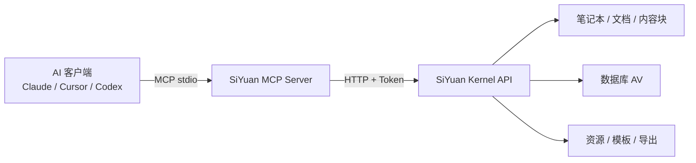

# 🧠 SiYuan MCP Server

> 让 Claude、Cursor、Codex 等 AI 客户端安全地读取和操作思源笔记。

`siyuan-mcp` 是一个基于 [Model Context Protocol](https://modelcontextprotocol.io/) 的思源笔记 MCP 服务器。它通过思源 Kernel API 提供笔记本、文档、内容块、全文搜索、原生数据库、资源文件和导出等能力，并针对 AI 自动化场景增加了结构化返回、安全注解与默认防护。

当前版本：`1.1.0`

---

## ✨ 核心亮点

| 能力 | 说明 |
| --- | --- |
| 📚 笔记本与文档 | 创建、浏览、搜索、重命名、移动和删除 |
| 🧱 内容块 | Markdown/DOM 插入、更新、移动、折叠、引用和批量操作 |
| 🔎 搜索 | 文档标题搜索、全文块搜索和受控 SQL 查询 |
| 🗃️ 原生数据库 | 创建 AV 数据库、字段、条目、单元格和批量更新 |
| 📎 文件与资源 | Multipart 上传、工作空间文件读写和二进制 Base64 返回 |
| 🧩 模板与转换 | Template、Sprig、Pandoc、Markdown 和资源导出 |
| 🛡️ 安全护栏 | 危险操作默认关闭、只读 SQL、路径白名单和响应上限 |
| 🤖 MCP 友好 | `structuredContent`、`isError`、工具安全注解和纯净 stdio |

项目目前提供约 69 个面向 AI 使用场景设计的工具。它选择性封装稳定且实用的思源接口，不追求暴露全部内核私有 API。

## 🧭 工作原理



所有调试信息只写入 `stderr`，`stdout` 始终保留给 MCP JSON-RPC，避免客户端因混入普通日志而断开连接。

---

## 🚀 快速开始

### 1. 准备环境

- Node.js `>= 18`
- 已启动的思源笔记
- 思源 API Token

API Token 获取位置：

> 思源笔记 → 设置 → 关于 → API Token

### 2. 使用 npx 启动

```bash
npx -y siyuan-mcp@latest
```

MCP 服务器通常由 AI 客户端自动启动，不需要单独打开终端常驻运行。

### 3. 配置 MCP 客户端

```json
{
  "mcpServers": {
    "siyuan_note": {
      "command": "npx",
      "args": ["-y", "siyuan-mcp@latest"],
      "env": {
        "SIYUAN_HOST": "127.0.0.1",
        "SIYUAN_PORT": "6806",
        "SIYUAN_TOKEN": "your-api-token-here"
      }
    }
  }
}
```

该配置形式可用于 Cursor、Claude Desktop 以及其他支持 stdio MCP 的客户端。不同客户端的配置文件位置可能不同，但 `command`、`args` 和 `env` 内容基本一致。

为兼容旧版配置，推荐继续使用 `SIYUAN_HOST`、`SIYUAN_PORT` 和 `SIYUAN_TOKEN`。只有连接 HTTPS 反向代理或带路径前缀的远程实例时，才需要使用 `SIYUAN_URL` 覆盖 HOST/PORT：

```json
{
  "env": {
    "SIYUAN_URL": "https://siyuan.example.com",
    "SIYUAN_TOKEN": "your-api-token-here"
  }
}
```

### 4. 验证连接

连接后可以让 AI 尝试：

```text
检查思源连接状态，并列出当前打开的笔记本。
```

或者直接调用：

- `check_siyuan_status`
- `list_notebooks`
- `get_version`

---

## 🧰 功能地图

### 📚 笔记本

| 工具 | 用途 |
| --- | --- |
| `list_notebooks` | 列出所有笔记本及打开状态 |
| `create_notebook` | 创建笔记本 |
| `open_notebook` / `close_notebook` | 打开或关闭笔记本 |
| `rename_notebook` | 重命名笔记本 |
| `get_notebook_conf` / `set_notebook_conf` | 读取或保存配置 |
| `remove_notebook` | 删除笔记本，属于危险操作 |

### 📄 文档与文档树

| 工具 | 用途 |
| --- | --- |
| `create_doc` | 使用 Markdown 创建文档 |
| `search_docs` | 按标题搜索文档 |
| `list_docs` | 浏览指定路径下的文档 |
| `rename_doc` / `rename_doc_by_id` | 重命名文档 |
| `move_docs` / `move_docs_by_id` | 移动文档 |
| `get_hpath_by_id` | 获取人类可读路径 |
| `get_path_by_id` | 获取底层存储路径 |
| `remove_doc` / `remove_doc_by_id` | 删除文档 |

### 🧱 内容块

支持 Markdown 和思源 DOM 两种输入格式。

| 工具 | 用途 |
| --- | --- |
| `insert_block` | 在指定锚点插入块 |
| `append_block` / `prepend_block` | 在父块前后插入子块 |
| `update_block` | 更新块内容 |
| `move_block` | 调整块位置 |
| `batch_insert_blocks` | 批量插入 |
| `batch_update_blocks` | 批量更新 |
| `get_block_info` | 获取块元数据 |
| `get_block_kramdown` | 获取 Kramdown 源码 |
| `get_block_breadcrumb` | 获取块面包屑 |
| `fold_block` / `unfold_block` | 折叠或展开 |
| `transfer_block_ref` | 转移块引用 |
| `set_block_attrs` / `get_block_attrs` | 操作块属性 |

`insert_block` 需要至少提供一个位置参数：

- `nextID`
- `previousID`
- `parentID`

### 🔎 搜索与查询

#### 全文搜索

`search_blocks` 使用思源原生全文搜索，支持：

- 普通关键词
- 查询语法
- 正则表达式
- 文档路径过滤
- 块类型过滤
- 分页、排序和按文档分组

#### SQL 查询

`sql_query` 默认仅允许 `SELECT` 或 CTE 查询，并自动补充 `LIMIT`，用于防止误写数据库或一次返回过多内容。

示例：

```sql
SELECT id, content, hpath, updated
FROM blocks
WHERE type = 'd'
ORDER BY updated DESC
LIMIT 20
```

优先使用 `search_docs` 和 `search_blocks`。只有在需要精确字段、聚合或复杂过滤时才建议使用 SQL。

---

## 🗃️ 原生数据库支持

数据库工具直接操作思源 Attribute View（AV），不是 Markdown 表格。

| 工具 | 用途 |
| --- | --- |
| `create_database` | 插入 AV 块并初始化数据库存储 |
| `get_database` | 分页渲染数据库 |
| `get_database_keys` | 获取字段定义 |
| `rename_database` | 重命名数据库 |
| `add_database_column` | 添加字段 |
| `remove_database_column` | 删除字段 |
| `append_database_rows` | 添加非绑定条目 |
| `set_database_cell` | 设置单元格 |
| `batch_set_database_cells` | 批量设置单元格 |
| `remove_database_rows` | 删除条目 |

### 创建数据库

```json
{
  "parentID": "20260628160104-6d71dw0",
  "name": "项目清单",
  "columns": [
    {
      "name": "状态",
      "type": "select"
    },
    {
      "name": "完成",
      "type": "checkbox"
    },
    {
      "name": "备注",
      "type": "text"
    }
  ]
}
```

创建过程会自动完成：

1. 生成合法 AV ID。
2. 插入 `NodeAttributeView` 块。
3. 调用 `renderAttributeView` 创建数据库存储。
4. 设置数据库名称。
5. 创建附加字段。

如果初始化失败，服务器会尝试回滚已插入的数据库块。

### 添加条目

```json
{
  "avID": "20260628163701-rc230o0",
  "blockID": "20260628163701-7rmjwsl",
  "titles": [
    "整理需求",
    "实现功能",
    "发布版本"
  ]
}
```

### 更新单元格

`set_database_cell` 的 `value` 使用思源 AV Value 结构。

文本字段示例：

```json
{
  "avID": "数据库 ID",
  "keyID": "字段 ID",
  "itemID": "条目 ID",
  "value": {
    "text": {
      "content": "已经完成"
    }
  }
}
```

复选框字段示例：

```json
{
  "value": {
    "checkbox": {
      "checked": true
    }
  }
}
```

常用字段类型包括：

`text`、`number`、`date`、`select`、`mSelect`、`url`、`email`、`phone`、`mAsset`、`checkbox`、`created` 和 `updated`。

---

## 📎 文件与资源

### 资源上传

`upload_asset` 使用真正的 HTTP Multipart 表单，不会把文件路径误当作 JSON 发送。

```json
{
  "assetsDirPath": "/assets/",
  "files": [
    "C:\\Users\\me\\Pictures\\diagram.png"
  ]
}
```

本地文件必须位于 `SIYUAN_MCP_UPLOAD_ROOTS` 允许的目录中。

### 工作空间文件

| 工具 | 用途 |
| --- | --- |
| `get_file` | 获取文本、JSON 或二进制文件 |
| `put_file` | Multipart 写入文件或创建目录 |
| `read_dir` | 浏览目录 |
| `rename_file` | 重命名文件 |
| `remove_file` | 删除文件 |

返回策略：

- JSON：直接返回结构化对象
- 文本：返回 UTF-8 字符串
- 二进制：返回 Base64、MIME 类型和字节数

`put_file` 支持三种输入方式：

- `filePath`：本地文件路径
- `file`：UTF-8 文本
- `contentBase64`：Base64 数据

---

## 🛡️ 安全设计

### 危险操作默认关闭

以下操作默认会被拒绝：

- 删除笔记本、文档和内容块
- 删除数据库字段或条目
- 覆盖、移动或删除工作空间文件

确认需要后启用：

```text
SIYUAN_MCP_ALLOW_DESTRUCTIVE=1
```

### SQL 默认只读

```text
SIYUAN_MCP_SQL_MAX_ROWS=200
```

仅在充分了解风险时关闭保护：

```text
SIYUAN_MCP_ALLOW_UNSAFE_SQL=1
```

### 工作空间写入白名单

默认允许：

```text
/data/assets,/temp
```

自定义：

```text
SIYUAN_MCP_WRITE_PATH_PREFIXES=/data/assets,/data/templates,/temp
```

### 本地上传目录白名单

默认只允许 MCP 进程当前目录。

Windows：

```text
SIYUAN_MCP_UPLOAD_ROOTS=C:\Users\me\Pictures;C:\Users\me\Documents
```

Linux/macOS：

```text
SIYUAN_MCP_UPLOAD_ROOTS=/home/me/Pictures:/home/me/Documents
```

### 远程连接

本地回环地址允许 HTTP：

```text
http://127.0.0.1:6806
```

远程实例必须使用 HTTPS。如果确实需要明文远程连接：

```text
SIYUAN_MCP_ALLOW_INSECURE_REMOTE=1
```

不建议在不可信网络中启用该选项。

---

## ⚙️ 环境变量

| 变量 | 默认值 | 说明 |
| --- | --- | --- |
| `SIYUAN_URL` | — | 完整思源 URL，优先于 HOST/PORT |
| `SIYUAN_HOST` | `127.0.0.1` | 思源主机 |
| `SIYUAN_PORT` | `6806` | 思源端口 |
| `SIYUAN_TOKEN` | 空 | 思源 API Token |
| `SIYUAN_MCP_ALLOW_DESTRUCTIVE` | `0` | 是否允许危险操作 |
| `SIYUAN_MCP_ALLOW_UNSAFE_SQL` | `0` | 是否允许非只读 SQL |
| `SIYUAN_MCP_SQL_MAX_ROWS` | `200` | SQL 默认最大行数 |
| `SIYUAN_MCP_WRITE_PATH_PREFIXES` | `/data/assets,/temp` | 工作空间写入白名单 |
| `SIYUAN_MCP_UPLOAD_ROOTS` | 当前目录 | 本地上传目录白名单 |
| `SIYUAN_MCP_TIMEOUT_MS` | `20000` | 单次 API 请求超时 |
| `SIYUAN_MCP_MAX_RESPONSE_BYTES` | `10485760` | 最大响应字节数 |
| `SIYUAN_MCP_MAX_TEXT_CHARS` | `30000` | MCP 文本预览长度 |
| `SIYUAN_MCP_ALLOW_INSECURE_REMOTE` | `0` | 是否允许远程 HTTP |
| `SIYUAN_MCP_DEBUG` | `0` | 向 stderr 输出端点、状态和耗时 |

调试模式不会输出请求 Token 或笔记正文。

---

## 🐳 Docker

本项目采用 MCP stdio 传输。容器必须由 MCP 客户端以前台交互模式启动，因此需要 `-i`。

### 构建镜像

```bash
docker build -t siyuan-mcp-server .
```

### MCP 客户端配置

```json
{
  "mcpServers": {
    "siyuan_note": {
      "command": "docker",
      "args": [
        "run",
        "--rm",
        "-i",
        "-e",
        "SIYUAN_HOST=host.docker.internal",
        "-e",
        "SIYUAN_PORT=6806",
        "-e",
        "SIYUAN_TOKEN",
        "siyuan-mcp-server"
      ],
      "env": {
        "SIYUAN_TOKEN": "your-api-token-here"
      }
    }
  }
}
```

注意：

- 容器内的 `127.0.0.1` 指向容器自身。
- 访问宿主机思源应使用 `host.docker.internal`。
- stdio MCP 不应使用普通后台 Compose 服务代替客户端进程。
- `docker compose run --rm siyuan-mcp-server` 可用于手工连通性检查。

---

## 📦 本地安装

```bash
git clone https://github.com/xgq18237/siyuan_mcp_server.git
cd siyuan_mcp_server
npm ci
npm run build
node dist/index.js
```

本地源码配置示例：

```json
{
  "mcpServers": {
    "siyuan_note": {
      "command": "node",
      "args": [
        "C:\\path\\to\\siyuan_mcp_server\\dist\\index.js"
      ],
      "env": {
        "SIYUAN_HOST": "127.0.0.1",
        "SIYUAN_PORT": "6806",
        "SIYUAN_TOKEN": "your-api-token-here"
      }
    }
  }
}
```

---

## 🧪 开发与检查

```bash
npm ci
npm run check
npm test
```

| 命令 | 说明 |
| --- | --- |
| `npm run dev` | 使用 `tsx` 运行源码 |
| `npm run check` | TypeScript 严格类型检查 |
| `npm run build` | 构建到 `dist/` |
| `npm test` | 执行类型检查并重新构建 |
| `npm run rebuild` | 清理后重新构建 |
| `npm run test:docker` | 构建测试 Docker 镜像 |

涉及真实思源数据的集成验证应在隔离笔记本中进行，并在完成后清理临时文档、数据库、资源与导出文件。

### 项目结构

```text
siyuan_mcp_server/
├─ src/
│  ├─ index.ts           # MCP 服务与资源
│  ├─ siyuan-client.ts   # JSON / Multipart / 二进制传输层
│  └─ tools.ts           # 工具定义、安全策略与调用实现
├─ dist/                 # 编译后的发布文件
├─ Dockerfile
├─ docker-compose.yml
├─ env.example
└─ package.json
```

---

## 🔧 常见问题

### MCP 客户端无法连接

依次确认：

1. 思源是否正在运行。
2. `SIYUAN_HOST`、`SIYUAN_PORT` 是否正确；使用远程反向代理时再检查 `SIYUAN_URL`。
3. API Token 是否有效。
4. Node.js 是否满足版本要求。
5. 是否有普通日志写入 stdout。

可以先在浏览器打开：

```text
http://127.0.0.1:6806
```

### 返回 `401`、`403` 或鉴权失败

重新复制思源“设置 → 关于”中的 API Token，并重启 MCP 进程。不要在 Token 前后加入引号以外的空格。

### 删除工具提示危险操作已关闭

这是正常的默认保护。明确需要删除能力时设置：

```text
SIYUAN_MCP_ALLOW_DESTRUCTIVE=1
```

### 上传文件提示不在允许目录

将文件移动到允许目录，或配置：

```text
SIYUAN_MCP_UPLOAD_ROOTS=允许的本地目录
```

### Docker 中无法访问思源

不要使用 `127.0.0.1` 访问宿主机，改用：

```text
SIYUAN_HOST=host.docker.internal
```

### 数据库块存在但无法正常显示

数据库不仅需要 AV 块，还需要对应的 AV 存储。请使用 `create_database`，它会自动调用 `renderAttributeView` 完成初始化。

### 输出过大被截断

优先使用分页、搜索条件或 SQL `LIMIT`。必要时调整：

```text
SIYUAN_MCP_MAX_RESPONSE_BYTES
SIYUAN_MCP_MAX_TEXT_CHARS
```

---

## 📤 发布

发布前：

```bash
npm test
npm audit
npm pack --dry-run
```

发布 npm：

```bash
npm login
npm publish --access public
```

### 使用 GitHub Actions 发布 npm

仓库中的 `Publish npm` Workflow 支持发布 GitHub Release 和手动触发。

1. 在 npm 创建 Granular Access Token。
2. 为 `siyuan-mcp` 授予读写权限，并启用 `Bypass 2FA`。
3. 在 GitHub 仓库打开 `Settings → Secrets and variables → Actions`。
4. 新建 Repository Secret：`NPM_TOKEN`。
5. 打开 `Actions → Publish npm → Run workflow`，选择 `latest`、`next` 或 `beta`。

通过 GitHub Release 自动发布时，Release 标签必须与 `package.json` 版本一致，例如：

```text
package.json: 1.1.0
Release tag: v1.1.0
```

Workflow 使用 Node.js 24，并在发布前自动执行依赖安装、类型检查和构建，同时为 npm 包生成 provenance。

发布约束：

- `src/` 是唯一源码来源。
- `dist/` 由 `npm run build` 生成。
- `prepublishOnly` 会自动执行检查。
- 不要把真实 Token、工作空间路径或测试数据提交到仓库。

---

## 🤝 贡献

欢迎提交 Issue 和 Pull Request。新增工具时建议同时考虑：

- 是否适合 AI 自动调用
- 是否属于危险或破坏性操作
- 是否需要分页和输出上限
- 是否应返回结构化数据
- 是否涉及 Multipart 或二进制响应
- 是否会把敏感内容写入日志

## 📄 License

[MIT](./LICENSE)
