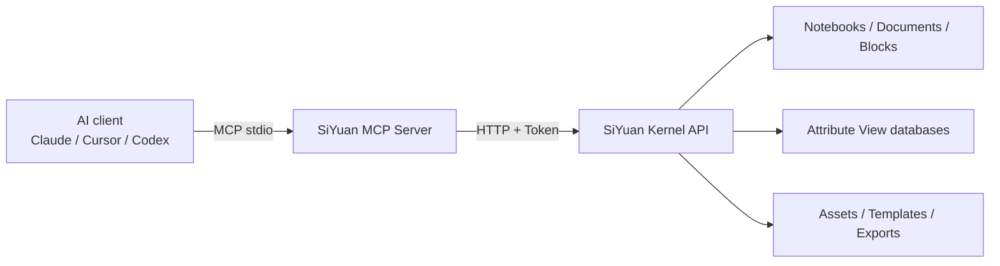

# 🧠 SiYuan MCP Server

[简体中文](./README.md) | [English](./README_EN.md)

> Let Claude, Cursor, Codex, and other AI clients read and operate your SiYuan workspace through MCP.

`siyuan-mcp` is a [Model Context Protocol](https://modelcontextprotocol.io/) server built on the SiYuan Kernel API. It provides notebook, document, block, full-text search, Attribute View database, file, asset, template, conversion, and export capabilities with structured MCP responses and configurable safeguards.

Current version: `1.1.0`

---

## ✨ Highlights

| Area | Capabilities |
| --- | --- |
| 📚 Notebooks and documents | Create, browse, search, rename, move, and delete |
| 🧱 Content blocks | Insert and update Markdown/DOM, move, fold, reference, and batch operations |
| 🔎 Search | Document title search, full-text block search, and SQL |
| 🗃️ Native databases | Create and manage Attribute View databases, fields, rows, and cells |
| 📎 Files and assets | Multipart uploads, workspace file access, and Base64 binary responses |
| 🧩 Templates and conversion | Templates, Sprig, Pandoc, Markdown export, and resource export |
| 🛡️ Optional safeguards | Destructive-operation protection, path allowlists, and response limits |
| 🤖 MCP friendly | `structuredContent`, `isError`, tool annotations, and clean stdio |

The server currently exposes about 69 tools designed for practical AI workflows. It intentionally wraps stable, useful SiYuan APIs instead of exposing every private Kernel endpoint.

## 🧭 How it works



Debug messages are written only to `stderr`. `stdout` remains reserved for MCP JSON-RPC so ordinary logs cannot break the client connection.

---

## 🚀 Quick start

### 1. Requirements

- Node.js `>= 18`
- A running SiYuan instance
- A SiYuan API Token

Find the token under:

> SiYuan → Settings → About → API Token

### 2. Start with npx

```bash
npx -y siyuan-mcp@latest
```

An MCP client normally starts the server automatically; you do not need to keep a separate terminal process running.

### 3. Configure your MCP client

```json
{
  "mcpServers": {
    "siyuan_note": {
      "command": "npx",
      "args": ["-y", "siyuan-mcp@latest"],
      "env": {
        "SIYUAN_HOST": "127.0.0.1",
        "SIYUAN_PORT": "6806",
        "SIYUAN_TOKEN": "your-api-token-here"
      }
    }
  }
}
```

This structure works with Cursor, Claude Desktop, and other stdio MCP clients. Configuration file locations vary, but the `command`, `args`, and `env` fields are generally the same.

For compatibility with earlier releases, `SIYUAN_HOST`, `SIYUAN_PORT`, and `SIYUAN_TOKEN` remain the recommended connection settings. Use `SIYUAN_URL` when connecting through a remote instance, reverse proxy, or URL path prefix:

```json
{
  "env": {
    "SIYUAN_URL": "https://siyuan.example.com",
    "SIYUAN_TOKEN": "your-api-token-here"
  }
}
```

### 4. Verify the connection

Ask the AI client:

```text
Check the SiYuan connection and list the currently open notebooks.
```

Or invoke:

- `check_siyuan_status`
- `list_notebooks`
- `get_version`

---

## 🧰 Feature map

### 📚 Notebooks

| Tool | Purpose |
| --- | --- |
| `list_notebooks` | List notebooks and their open/closed state |
| `create_notebook` | Create a notebook |
| `open_notebook` / `close_notebook` | Open or close a notebook |
| `rename_notebook` | Rename a notebook |
| `get_notebook_conf` / `set_notebook_conf` | Read or save notebook configuration |
| `remove_notebook` | Delete a notebook and its contents |

### 📄 Documents and document tree

| Tool | Purpose |
| --- | --- |
| `create_doc` | Create a document from Markdown |
| `search_docs` | Search document titles |
| `list_docs` | Browse a document path |
| `rename_doc` / `rename_doc_by_id` | Rename documents |
| `move_docs` / `move_docs_by_id` | Move documents |
| `get_hpath_by_id` / `get_hpath_by_path` | Resolve human-readable paths |
| `get_path_by_id` / `get_ids_by_hpath` | Resolve storage paths and IDs |
| `remove_doc` / `remove_doc_by_id` | Delete documents |

### 🧱 Content blocks

Both Markdown and SiYuan DOM input formats are supported.

| Tool | Purpose |
| --- | --- |
| `insert_block` | Insert a block at an anchor |
| `append_block` / `prepend_block` | Add a child at the end or beginning |
| `update_block` | Update block content |
| `move_block` | Change block position |
| `batch_insert_blocks` / `batch_update_blocks` | Perform batch operations |
| `get_block_info` | Read block metadata |
| `get_block_kramdown` | Read Kramdown source |
| `get_block_breadcrumb` | Read block breadcrumbs |
| `get_child_blocks` | List direct children |
| `fold_block` / `unfold_block` | Fold or unfold a block |
| `transfer_block_ref` | Transfer block references |
| `set_block_attrs` / `get_block_attrs` | Write or read block attributes |
| `delete_block` | Delete a block |

`insert_block` requires at least one position field:

- `nextID`
- `previousID`
- `parentID`

### 🔎 Search and SQL

`search_blocks` supports keywords, query syntax, regular expressions, document-path filtering, block-type filtering, pagination, sorting, and document grouping.

`sql_query` passes SQL directly to the SiYuan Kernel API. It does not restrict statement types or add an automatic `LIMIT`. Confirm the impact before running write, delete, or schema-changing statements, and add `LIMIT` yourself for large queries.

```sql
SELECT id, content, hpath, updated
FROM blocks
WHERE type = 'd'
ORDER BY updated DESC
LIMIT 20
```

Prefer `search_docs` and `search_blocks` for ordinary searches. Use SQL when precise columns, aggregation, or complex filtering are needed.

---

## 🗃️ Native Attribute View databases

These tools operate on native SiYuan Attribute Views rather than Markdown tables.

| Tool | Purpose |
| --- | --- |
| `create_database` | Insert and initialize an Attribute View |
| `get_database` | Render a paginated database view |
| `get_database_keys` | Read field definitions |
| `rename_database` | Rename a database |
| `add_database_column` / `remove_database_column` | Add or remove fields |
| `append_database_rows` | Add detached rows |
| `set_database_cell` | Update one cell |
| `batch_set_database_cells` | Update multiple cells |
| `remove_database_rows` | Delete rows |

### Create a database

```json
{
  "parentID": "20260628160104-6d71dw0",
  "name": "Project tracker",
  "columns": [
    {
      "name": "Status",
      "type": "select"
    },
    {
      "name": "Done",
      "type": "checkbox"
    },
    {
      "name": "Notes",
      "type": "text"
    }
  ]
}
```

The tool automatically:

1. Generates a valid Attribute View ID.
2. Inserts a `NodeAttributeView` block.
3. Calls `renderAttributeView` to initialize storage.
4. Sets the database name.
5. Creates the requested fields.

If initialization fails, the server attempts to roll back the inserted database block.

### Add rows

```json
{
  "avID": "20260628163701-rc230o0",
  "blockID": "20260628163701-7rmjwsl",
  "titles": [
    "Review requirements",
    "Implement feature",
    "Publish release"
  ]
}
```

### Update a cell

`set_database_cell.value` uses SiYuan's Attribute View value structure.

Text field:

```json
{
  "avID": "database-id",
  "keyID": "field-id",
  "itemID": "row-id",
  "value": {
    "text": {
      "content": "Completed"
    }
  }
}
```

Checkbox field:

```json
{
  "value": {
    "checkbox": {
      "checked": true
    }
  }
}
```

Common field types include `text`, `number`, `date`, `select`, `mSelect`, `url`, `email`, `phone`, `mAsset`, `checkbox`, `created`, and `updated`.

---

## 📎 Files and assets

### Asset uploads

`upload_asset` uses a real HTTP Multipart form. File paths are not incorrectly sent as JSON values.

```json
{
  "assetsDirPath": "/assets/",
  "files": [
    "C:\\Users\\me\\Pictures\\diagram.png"
  ]
}
```

Local files must be located under a directory permitted by `SIYUAN_MCP_UPLOAD_ROOTS`.

### Workspace files

| Tool | Purpose |
| --- | --- |
| `get_file` | Read text, JSON, or binary files |
| `put_file` | Write a file or create a directory with Multipart |
| `read_dir` | Browse a directory |
| `rename_file` | Rename a file |
| `remove_file` | Delete a file |

Response handling:

- JSON: returned as structured data
- Text: returned as UTF-8
- Binary: returned as Base64 with MIME type and byte length

`put_file` accepts:

- `filePath`: a local file path
- `file`: UTF-8 text
- `contentBase64`: Base64-encoded bytes

---

## 🛡️ Safety model

### Optional destructive-operation protection

Destructive operations are available by default. To allow create, read, and ordinary update operations while rejecting destructive ones, explicitly enable:

```text
SIYUAN_MCP_PROTECT_DESTRUCTIVE=true
```

Only `true` or `1` activates the protection. It rejects:

- Deleting notebooks, documents, and blocks
- Deleting database fields or rows
- Overwriting, moving, or deleting workspace files

When the variable is absent, `false`, or `0`, destructive operations remain available.

> Upgrade note: the old `SIYUAN_MCP_ALLOW_DESTRUCTIVE` variable is no longer used. To retain a reject-destructive-operations policy, use `SIYUAN_MCP_PROTECT_DESTRUCTIVE=true`.

### Direct SQL execution

`sql_query` accepts SQL supported by the SiYuan Kernel API. It no longer separates “safe” and “unsafe” SQL or adds a row limit automatically. Add `LIMIT` where appropriate and handle write or schema-changing statements carefully.

The old `SIYUAN_MCP_ALLOW_UNSAFE_SQL` and `SIYUAN_MCP_SQL_MAX_ROWS` variables are no longer used.

### Workspace write allowlist

Default:

```text
/data/assets,/temp
```

Custom:

```text
SIYUAN_MCP_WRITE_PATH_PREFIXES=/data/assets,/data/templates,/temp
```

### Local upload allowlist

By default, only the MCP process working directory is allowed.

Windows:

```text
SIYUAN_MCP_UPLOAD_ROOTS=C:\Users\me\Pictures;C:\Users\me\Documents
```

Linux/macOS:

```text
SIYUAN_MCP_UPLOAD_ROOTS=/home/me/Pictures:/home/me/Documents
```

### Connection addresses

`SIYUAN_HOST` and `SIYUAN_URL` may point to local or remote instances. Both HTTP and HTTPS are accepted without an additional MCP restriction. For public or untrusted networks, HTTPS is still recommended to protect the API Token and transferred content.

---

## ⚙️ Environment variables

| Variable | Default | Description |
| --- | --- | --- |
| `SIYUAN_URL` | — | Complete SiYuan URL; overrides HOST/PORT |
| `SIYUAN_HOST` | `127.0.0.1` | SiYuan host |
| `SIYUAN_PORT` | `6806` | SiYuan port |
| `SIYUAN_TOKEN` | empty | SiYuan API Token |
| `SIYUAN_MCP_PROTECT_DESTRUCTIVE` | `false` | Reject destructive operations only when explicitly `true` or `1` |
| `SIYUAN_MCP_WRITE_PATH_PREFIXES` | `/data/assets,/temp` | Workspace write allowlist |
| `SIYUAN_MCP_UPLOAD_ROOTS` | current directory | Local upload allowlist |
| `SIYUAN_MCP_TIMEOUT_MS` | `120000` | Per-request timeout (2 minutes) |
| `SIYUAN_MCP_MAX_RESPONSE_BYTES` | `10485760` | Maximum response size in bytes |
| `SIYUAN_MCP_MAX_TEXT_CHARS` | `30000` | MCP text preview length |
| `SIYUAN_MCP_DEBUG` | `0` | Log endpoint, status, and timing to stderr |

Debug mode does not print request Tokens or note content.

---

## 🐳 Docker

This project uses MCP stdio transport. The MCP client must run the container interactively in the foreground, so `-i` is required.

### Build

```bash
docker build -t siyuan-mcp-server .
```

### MCP client configuration

```json
{
  "mcpServers": {
    "siyuan_note": {
      "command": "docker",
      "args": [
        "run",
        "--rm",
        "-i",
        "-e",
        "SIYUAN_HOST=host.docker.internal",
        "-e",
        "SIYUAN_PORT=6806",
        "-e",
        "SIYUAN_TOKEN",
        "siyuan-mcp-server"
      ],
      "env": {
        "SIYUAN_TOKEN": "your-api-token-here"
      }
    }
  }
}
```

Notes:

- `127.0.0.1` inside the container points to the container itself.
- Use `host.docker.internal` to access SiYuan on the host.
- Do not replace the client-managed stdio process with an ordinary background Compose service.
- `docker compose run --rm siyuan-mcp-server` is useful for manual connectivity checks.

---

## 📦 Local installation

```bash
git clone https://github.com/xgq18237/siyuan_mcp_server.git
cd siyuan_mcp_server
npm ci
npm run build
node dist/index.js
```

Local source configuration:

```json
{
  "mcpServers": {
    "siyuan_note": {
      "command": "node",
      "args": [
        "C:\\path\\to\\siyuan_mcp_server\\dist\\index.js"
      ],
      "env": {
        "SIYUAN_HOST": "127.0.0.1",
        "SIYUAN_PORT": "6806",
        "SIYUAN_TOKEN": "your-api-token-here"
      }
    }
  }
}
```

---

## 🧪 Development and checks

```bash
npm ci
npm run check
npm test
```

| Command | Description |
| --- | --- |
| `npm run dev` | Run TypeScript source with `tsx` |
| `npm run check` | Run strict TypeScript checking |
| `npm run build` | Build into `dist/` |
| `npm test` | Type-check and rebuild |
| `npm run rebuild` | Clean and rebuild |
| `npm run test:docker` | Build a test Docker image |

Integration tests that touch real SiYuan data should use an isolated notebook and clean temporary documents, databases, assets, and exports afterward.

### Project structure

```text
siyuan_mcp_server/
├─ src/
│  ├─ index.ts           # MCP server and resources
│  ├─ siyuan-client.ts   # JSON / Multipart / binary transport
│  └─ tools.ts           # Tool definitions, safeguards, and invocation
├─ dist/                 # Compiled release files
├─ Dockerfile
├─ docker-compose.yml
├─ env.example
└─ package.json
```

---

## 🔧 Troubleshooting

### The MCP client cannot connect

Check:

1. SiYuan is running.
2. `SIYUAN_HOST` and `SIYUAN_PORT` are correct; also check `SIYUAN_URL` for a remote reverse proxy.
3. The API Token is valid.
4. The Node.js version meets the requirement.
5. No ordinary logs are being written to stdout.

Try opening this URL in a browser:

```text
http://127.0.0.1:6806
```

### `401`, `403`, or authentication failure

Copy the API Token again from SiYuan → Settings → About, then restart the MCP process. Avoid extra whitespace around the token.

### A delete tool says destructive-operation protection is enabled

The MCP process explicitly enabled protection. Remove the variable or set:

```text
SIYUAN_MCP_PROTECT_DESTRUCTIVE=false
```

### An upload path is not allowed

Move the file into an allowed directory or configure:

```text
SIYUAN_MCP_UPLOAD_ROOTS=allowed-local-directory
```

### Docker cannot reach SiYuan

Do not use `127.0.0.1` for the host machine. Use:

```text
SIYUAN_HOST=host.docker.internal
```

### A database block exists but does not render correctly

An Attribute View needs both a block and backing AV storage. Use `create_database`; it calls `renderAttributeView` during initialization.

### Output is truncated

Use pagination, filters, or SQL `LIMIT`. If needed, adjust:

```text
SIYUAN_MCP_MAX_RESPONSE_BYTES
SIYUAN_MCP_MAX_TEXT_CHARS
```

---

## 📤 Publishing

Before publishing:

```bash
npm test
npm audit
npm pack --dry-run
```

Publish to npm:

```bash
npm login
npm publish --access public
```

### Publish npm with GitHub Actions

The repository's `Publish npm` workflow supports both GitHub Releases and manual dispatch.

1. Create a Granular Access Token on npm.
2. Grant read/write access to `siyuan-mcp` and enable `Bypass 2FA`.
3. Open `Settings → Secrets and variables → Actions` in the GitHub repository.
4. Create a Repository Secret named `NPM_TOKEN`.
5. Open `Actions → Publish npm → Run workflow` and select `latest`, `next`, or `beta`.

For automatic publishing from a GitHub Release, the release tag must match the version in `package.json`:

```text
package.json: 1.1.0
Release tag: v1.1.0
```

The workflow uses Node.js 24, installs dependencies, runs type checks and the build, and publishes npm provenance.

Release rules:

- `src/` is the source of truth.
- `dist/` is generated by `npm run build`.
- `prepublishOnly` runs checks automatically.
- Never commit real Tokens, workspace paths, or test data.

---

## 🤝 Contributing

Issues and pull requests are welcome. When adding a tool, consider:

- Whether it is suitable for automated AI use
- Whether it is destructive
- Whether it needs pagination or output limits
- Whether it should return structured data
- Whether it uses Multipart or binary responses
- Whether sensitive content could be written to logs

## 📄 License

[MIT](./LICENSE)
